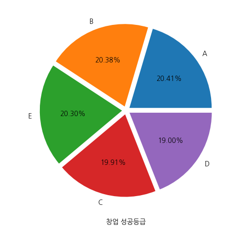
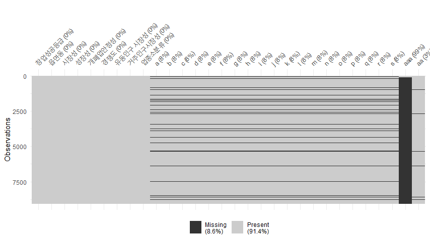
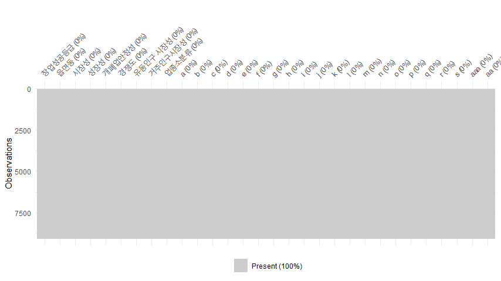
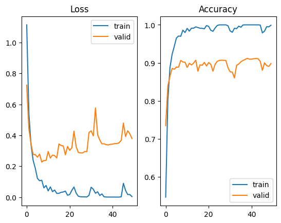
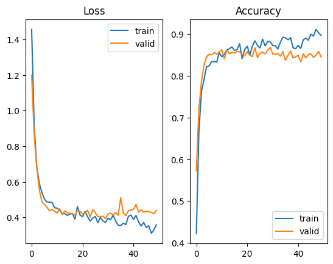
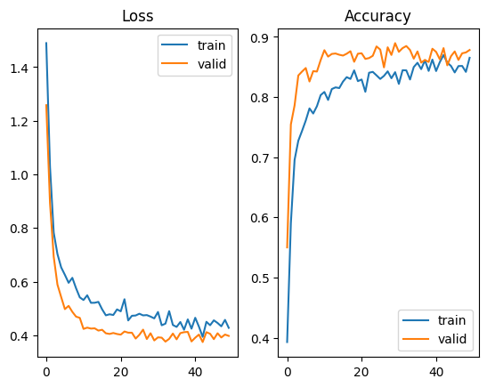
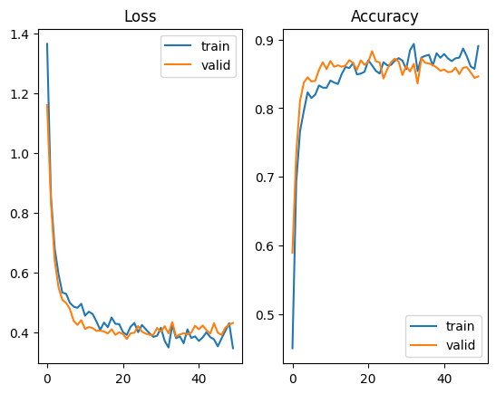
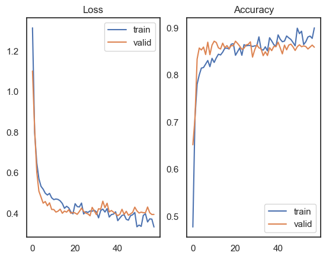
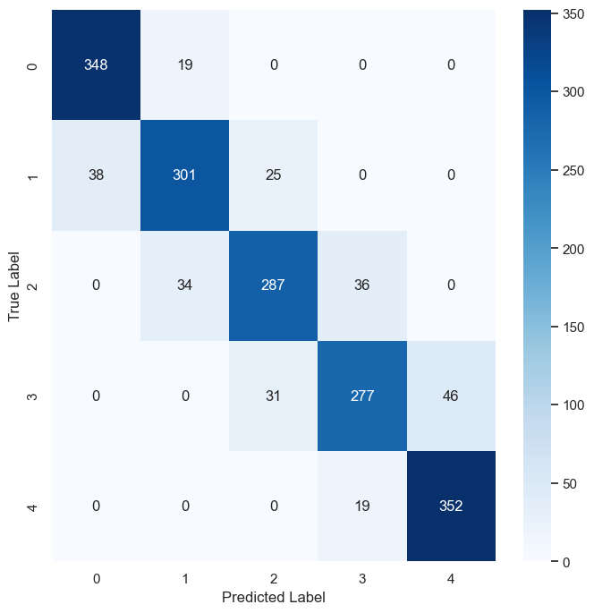
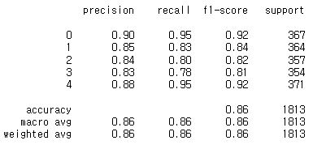

# 2023년 제3회 금융 데이터 활용 아이디어 경진대회
## 팀 프로젝트
여러 개의 데이터를 결합하여 사용할 때 발생하는 결측치를 단순 평균값이나 중앙값 등 하나의 값으로 결측치를 채우는 단순 대치법(Single Imputation)이 아닌, 다중 대치법(Multiple Imputation)을 이용해 채우고, 과적합이 발생하는 base model에 과적합 억제 기법을 적용하여 다중 분류 모델(Multiclass Classification Model)을 구현했습니다.

예측에 사용한 데이터는 '롯데 카드'에서 제공한 '전라북도 행정동 업종별 상권 평가' 데이터와 '소상공인 마당'에서 제공하는 읍면동별 3km를 기준 '직장인구의 상반기 평균 소득, 평균 소비 금액과 하반기 평균 소득, 평균 소비 금액'등을 크롤링한 데이터를 전라북도 지역의 읍면동을 나타내는 컬럼을 기준으로 결합한 데이터입니다.

전라북도 행정동 업종별 상권 평가 데이터에는 범주형 변수로 창업 성공 듭급을 'A'부터 'E'까지 나태난 변수입니다.


이 종속 변수를 이용하여 다중 분류 모델을 만들었습니다. 창업 성공 등급이 가장 높은 'A'부터 가장 낮은 'E'까지의 등급을 예측하는 모델입니다. 이 모델을 통해 전라북도 지역 예비 창업자의 의사결정을 돕고자 합니다.

## Stack
```
Python
R
Keras
TensorFlow
```

# 코드 실행
## 1. Data preprocessing
### 1.1 Handling missing values with MICE(Multivariate Imputation by Chained Equations)
아래 .R로 기술되어 있음 https://github.com/HyunJae0/multiclass-classification/blob/main/%EA%B8%88%EC%9C%B5%EB%8D%B0%EC%9D%B4%ED%84%B0%20%EA%B3%B5%EB%AA%A8%EC%A0%84%20%EB%8D%B0%EC%9D%B4%ED%84%B0%20%EA%B2%B0%EC%B8%A1%EA%B0%92%20%EC%B2%98%EB%A6%AC.R

데이터를 결합했을 때 발생하는 결측치 컬럼들은 모두 크롤링 데이터의 컬럼들입니다. 다음과 같이  'a'컬럼부터 'aa'컬럼까지 결측치가 존재하며, 'aaa'라는 컬럼은 결측치가 99%입니다. 
(컬럼명을 영여로 변경한 이유는 결측치를 채우고자 하는 컬럼명이 한글일 경우 오류가 발생하여, 알파벳으로 처리하였습니다. 'a'부터 'aaa'는 10대부터 60대까지의 2022년 상반기, 하반기 평균 소득, 소비 금액이며, 마지막 컬럼은 전북지역 직장인구 수입니다. 'aaa'컬럼은 60대 이상 직장인구의 2022년 하반기 소비 금액입니다.)


결측치(missing value)는 변수에서 관측치가 없어 발생하는 NA(not available) 값을 의미합니다. 결측치를 제거하고 예측을 수행하면 대부분의 경우에 통계적 추론의 타당성 문제(정보 손실, 표본 편향, 결과 왜곡 등)가 생깁니다. 

결측치를 채우는 일반적인 방법은  특정 통계량(평균, 중앙값, 최빈값) 혹은 그 위에 있는 값이나 아래에 있는 값으로 대체하는 단순 대치법입니다. 하지만 단순 대치법으로 데이터의 결측치를 채우고, 해당 데이터를 사용해 예측을 수행할 경우 특정 대체 값으로 인해 어떤 패턴이 발생한다면, 모델이 이 패턴에 과도하게 의존하게 만들어 새로운 데이터에 대한 일반화 성능을 저하시킬 수 있습니다. 이러한 단순 대치법의 한계를 보완하기 위한 방법이 다중 대치법입니다.

프로젝트에서 사용한 결측치 핸들러는 R에서 제공하는 Multivariate Imputation by Chained Equations(MICE) 패키지입니다. (R에서 제공하는) MICE는 다변량 결측 데이터를 채우기 위해 여러 개의 multiple imputation(대체 값)을 생성합니다. 동작 방법은 다음 예시와 같습니다.

(출처: https://www.scirp.org/journal/paperinformation?paperid=112455)
Age, Income, Gender라는 세 개의 컬럼에 각각 결측치가 존재합니다.  먼저 각 컬럼별 평균값으로 결측치를 채웁니다. Age의 결측치는 Age 컬럼의 평균값을 이용해 채운 값입니다. Income과 Gender 컬럼에도 동일한 방법으로 결측치를 채웁니다.

그다음, Age의 결측치 부분을 다시 결측치(N.A)로 처리합니다. 이 결측치를 타깃으로 두고 결측치가 없는 데이터(1행, 2행)를 사용해서 타깃을 선형 회귀 모델로 예측합니다. 이 그림에서는 예측 결과로 Age의 N.A 값이 35.3이 나왔습니다. 동일한 방법으로 나머지 컬럼의 결측치를 예측합니다. 이 과정이 하나의 루프입니다. 실제는 여러 번의 루프로 반복해서 진행됩니다.

이 방법을 R의 MICE 패키지를 이용해 사용했으며, 루프 횟수(다중 대치법 횟수)는 default 값 m =5를 사용했습니다. 

다중 대치법은 간단히 말하면 결측치가 있는 데이터 셋에서 m 번의 대치를 통해 결측치를 채우는 방법입니다.
예를 들어 데이터가 100개이고 그중 결측치가 2인 경우, 결측치가 없는 98개의 데이터 중 샘플링을 통해 50개의 데이터를 추출해서 완전한 데이터 셋을 만든다고 가정하겠습니다. 만약 m = 5라면, 각각 샘플링된 50개로 구성된 데이터 셋이 5개가 됩니다.
이 5개의 데이터 셋에 대해 각각 선형 회귀 모델로 학습하여 결측치 값을 예측합니다. 그러면 5개의 데이터 셋 각각에서 서로 다른 예측값을 산출하게 될 것입니다. 최종적으로, 이렇게 얻은 예측값들을 결합(평균이나 다른 방법)하여 대체할 결측치의 최종 값을 도출합니다.

물론 MICE로 채워진 값이 원본 데이터와 정확하게 일치한다는 보장이 없으나 편향이 감소하므로 모델이 특정 패턴에 치우쳐 학습하는 것을 방지할 수 있습니다. 즉, 단순 대치법을 적용하는 것보다 더 실제 데이터처럼 결측치를 채울 수 있습니다.

다음 그림은 R 환경에서 결측치를 MICE 패키지를 사용해 채운 결과입니다.


예측에 사용하는 데이터 프레임은 다음과 같습니다.
```
df=pd.read_csv('결측치대체2.csv',encoding="cp949")
df.columns
```


```
df.head(5)
```


수치형 변수에는 RobustScaler를 적용하고 범주형 변수인 창업 성공 등급은 어떤 순서를 의미하는 값이 아니기 때문에 LabelEncoder를 적용해서 'A'는 0, 'B'는 1, ... , 'E'는 4로 변환했습니다. 예측에 사용할 최종 데이터 프레임을 생성했습니다.
```
comp
```


```
from sklearn.preprocessing import LabelEncoder
encoder = LabelEncoder()
comp['target'] = encoder.fit_transform(comp['창업성공등급'])
comp[['target']].value_counts()
```


## 2. Modeling
아래 Jupyter Notebook으로 기술되어 있음
https://github.com/HyunJae0/tensorflow-multiclass-classification/blob/main/tensorflow_multiple_classification.ipynb

예측에 사용된 데이터는 총 9,063개로 비교적 작은 규모에 해당합니다. 그러나 데이터 개수에 비해 독립 변수는 473개로 많아, 머신 러닝 알고리즘을 사용할 경우 과적합이 발생할 가능성이 높습니다. 

그러므로 아주 작은 블록부터 시작해 모델 성능을 점검하며 개선해 나가는 방식을 채택했습니다. 이를 위해 딥러닝 프레임워크인 TensorFlow를 이용해 기본 모델(Base Model)을 생성한 뒤, 해당 모델의 성능을 확인하며, 점진적으로 개선하는 접근 방식을 선택했습니다.

첫 번째 기본 모델은 다음과 같습니다. input → Affine → Activation → Affine → Activation → Affine → Softmax 계층으로 구성된 간단한 완전연결계층입니다. 활성화 함수로 ReLU를 사용하기 때문에 가중치 초깃값은 He normal을 사용했습니다. 모델을 재사용하고자 함수로 모델을 정의하였습니다.
```
def base_model():
    initializer = tf.keras.initializers.HeNormal(seed = 42)
    inputs = tf.keras.layers.Input(shape=(n_features,))
    x1 = tf.keras.layers.Dense(255, activation = 'relu', kernel_initializer=initializer)(inputs)
    x2 = tf.keras.layers.Dense(125, activation = 'relu', kernel_initializer=initializer)(x1)
    outputs = tf.keras.layers.Dense(5, activation = 'softmax')(x2)
    model = tf.keras.Model(inputs, outputs, name = 'base_model')
    return model
```

첫 번째 base model의 성능은 다음과 같습니다.
```
model_1.compile(optimizer = 'Adam',
                loss = 'sparse_categorical_crossentropy', # 타겟이 0, 1, 2 정수로 인코딩되어 있으므로
                metrics=['accuracy'])
model_1.fit(X_train, y_train, validation_data=(X_valid, y_valid), epochs=50)
```


학습을 시작한 지 얼마 지나지 않아 과적합이 발생하는 것을 확인할 수 있습니다.

과적합을 억제하고자 다음과 같이 L2 규제 + 배치 정규화 계층을 추가한 두 번째 base model과, L2 규제 + 드롭아웃 + 배치 정규화 계층을 추가한 세 번째 base model을 정의하였습니다.

드롭아웃 계층을 포함한 모델을 별도로 정의한 이유는, 드롭아웃이 학습 과정과 테스트 과정에서 다른 방식으로 동작하기 때문입니다. 

학습 과정에서 일부 뉴런을 무작위로 비활성화하여 모델이 특정 뉼너에 의존하지 않고 일반화된 특성을 학습하도록 합니다. 반면, 테스트 과정에서는 모든 뉴런을 활성화하여 성능을 평가합니다.

이러한 특성 때문에, 학습 데이터 수가 적은 상황에서는 드롭아웃이 오히려 검증/테스트 셋보다 학습 데이터 셋이 적은 수로 학습하여 검증/테스트 셋의 성능이 높게 나타날 수 있습니다. 
```
regularizer=tf.keras.regularizers.l2(0.001)
def base_model2():
    initializer = tf.keras.initializers.HeNormal(seed = 42)
    
    inputs = tf.keras.layers.Input(shape=(n_features,))
    x = tf.keras.layers.Dense(61, kernel_regularizer = regularizer, kernel_initializer=initializer)(inputs)
    x = tf.keras.layers.BatchNormalization()(x)
    x = tf.keras.layers.Activation('relu')(x)
    x = tf.keras.layers.Dense(16, kernel_regularizer = regularizer, kernel_initializer=initializer)(x)    
    outputs = tf.keras.layers.Dense(5, activation = 'softmax')(x)
    
    model = tf.keras.Model(inputs, outputs, name = 'base_model2')
    return model
```

```
def base_model3():
    initializer = tf.keras.initializers.HeNormal(seed = 42)
    
    inputs = tf.keras.layers.Input(shape=(n_features,))
    x = tf.keras.layers.Dense(61, kernel_regularizer = regularizer, kernel_initializer=initializer)(inputs)
    x = tf.keras.layers.BatchNormalization()(x)
    x = tf.keras.layers.Activation('relu')(x)
    # 데이터 수가 적기 때문에 드롭아웃 추가 시, 정확도 train set이 valid set 성능보다 떨어질 수 있으므로 조금만 적용
    x = tf.keras.layers.Dropout(0.2)(x)
    x = tf.keras.layers.Dense(16, kernel_regularizer = regularizer, kernel_initializer=initializer)(x)
    outputs = tf.keras.layers.Dense(5, activation = 'softmax')(x)
    
    model = tf.keras.Model(inputs, outputs, name = 'base_model3')
    return model
```

다음 그림은 두 번째와 세 번째 base model에 대한 성능 결과입니다.
<div style="display: flex;">
  
  
</div>
L2 규제에 드롭아웃까지 적용하니 우려하던 현상이 발생하였습니다. 이에, 다음 base model에는 드롭아웃을 제외하고 L2 규제만 적용하였습니다. 첫 번째 base model과 L2 규제 + 배치 정규화를 적용한 두 번째 base model의 결과를 비교한 결과, 데이터 셋을 고려했을 때 두 번째 모델(드롭아웃을 사용하지 않는 모델)이 더 작합하다고 판단하였습니다.

단, 활성화 함수를 ReLU에서 LeakyReLU로 변경하였습니다. ReLU는 ReLU(x) = max(0, x)으로 x가 0보다 작거나 같으면 0을 다음 계층으로 출력하기 때문에 역전파 과정에서 기울기 소실이 발생했을 수도 있습니다. LeakyReLU(x) = madx(ax, x)이므로 기울기 소실 현상을 방지할 수 있습니다. 이때, a = 0.2를 사용했습니다.

네 번째 base model은 다음과 같습니다. 
```
def base_model4():
    initializer = tf.keras.initializers.HeNormal(seed = 42)
    
    inputs = tf.keras.layers.Input(shape=(n_features,))
    x = tf.keras.layers.Dense(61, kernel_regularizer = regularizer, kernel_initializer=initializer)(inputs)
    x = tf.keras.layers.BatchNormalization()(x)
    x = tf.keras.layers.LeakyReLU(alpha = 0.2)(x)
    x = tf.keras.layers.Dense(16, kernel_regularizer = regularizer, kernel_initializer=initializer)(x)    
    outputs = tf.keras.layers.Dense(5, activation = 'softmax')(x)
    
    model = tf.keras.Model(inputs, outputs, name = 'base_model4')
    return model
```

다음 그림은 첫 번재 base model과 네 번째 base model의 성능입니다. 모델이 많이 개선된 것을 확인할 수 있습니다.
<div style="display: flex;">
  
  
</div>

네 번째 base model을 최종 모델로 선정하였습니다. 해당 모델에 조기 종료를 설정하고 epoch을 더 길게하여 학습을 수행했습니다.
```
# 학습이 끝난 후, 모델의 가중치 중 가장 좋았을 때의 가중치로 복원
# False면 마지막 시점의 가중치가 적용된다.
early_stopping = tf.keras.callbacks.EarlyStopping(monitor='val_loss',  
                                                  patience=30, 
                                                  mode = 'min', restore_best_weights=True) 
```

```
model_4 = base_model4()
model_4.compile(optimizer = 'Adam',  loss = 'sparse_categorical_crossentropy', metrics=['accuracy'])
model_4.fit(X_train, y_train, validation_data=(X_valid, y_valid), epochs=100, callbacks=[early_stopping])
```

30번의 epoch 동안 val_loss의 값이 최솟값으로 갱신되지 않아 epoch 58에서 학습이 종료되었습니다. restore_best_weights=True를 설정하였기 때문에 학습 종료 후, 가장 성능이 좋았던(검증 손실이 가장 낮았던) 시점의 모델 가중치를 복원합니다.

valid set에 대해 약 85~86%의 정확도를 가지는 것을 확인할 수 있습니다.


이제 unseen data인 test set에 대해 모델을 평가하였습니다.
```
score=model_4.evaluate(X_test,y_test)
print('%s: %.2f%%' %(model_4.metrics_names[1],score[1]*100))
```
그 결과, 다음과 같이 약 86%의 정확도를 보이는 것을 확인할 수 있습니다.


최종 선정한 모델을 저장합니다.
```
model_4.save('model_4.h5')
```

# 결과
모든 클래스에 대한 성능을 보기 위해 y_test를 다음과 같이 원-핫 벡터 형태로 변환해서 혼동 행렬을 확인하였습니다.
```
from tensorflow.keras.utils import to_categorical
from sklearn.metrics import confusion_matrix

y_test_one_hot = to_categorical(y_test)

y_true = np.argmax(y_test_one_hot, axis=1)  
y_pred_classes = np.argmax(y_pred, axis=1)  
cm = confusion_matrix(y_true, y_pred_classes)
```




모델은 정반적으로 양호한 성능을 보입니다. 클래스 0(등급 'A')와 클래스 4(등급 'E')에 대한 성능이 우수합니다. 클래스 3(등급 'D')는 다른 클래스에 비해 recall이 낮으므로, 실제 클래스 3을 놓치는 경우가 다른 클래스에 비해 더 많다는 것을 확인할 수 있습니다.
